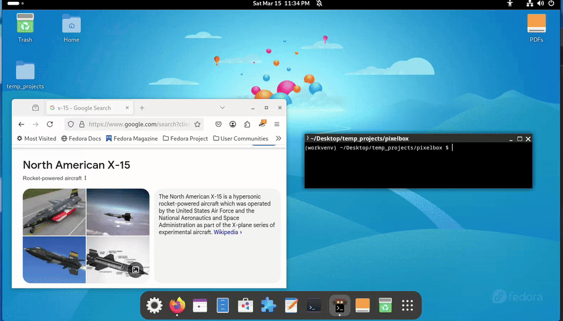

# PixelBox

A **Linux** Application to measure desktop objects by dragging yellow rectangles that measure width and height in pixels.

[](https://img.shields.io/github/commit-activity/m/travisseymour/pixelbox)
[](https://img.shields.io/github/license/travisseymour/pixelbox)

The PixelBox application makes it easy to measure the extent of rectangular regions on your display by using your mouse to draw dimension labeled yellow boxes. If it's in your way, you can use the number keys 1, 2, 3, 4 to move the PixelBox title window to the upper-left, upper-right, lower-left, and lower-right corners of the display. This is useful to measure areas that the title window obstructs.

Using the righ-click menu, you can clear the last box, all boxes, or save the box drawings to a PNG image on disk.



Note: I have plans to include support for non-Linux systems...later. At the moment, PixelBox only works on Linux.

---

## Installation

### Preparation

1. Make sure you have [uv](https://docs.astral.sh/uv/) installed.

2. Make sure you have Python 3.10 or higher installed. If you need to install a version of Python, you can use `uv` to do this, for example:
   
    To check to see which versions of Python you already have
   
   ```bash
   uv python list
   ```
   
    To install Python 3.11
   
   ```bash
   uv python install 3.11
   ```

### Installation

```bash
uv tool install git+https://github.com/travisseymour/pixelbox.git
```


### Upgrade

```bash
uv tool upgrade pixelbox
```


### Removal

Before you uninstall pixelbox, first run the command below to remove pixelbox from your launcher!

```bash
pixelbox cleanup
```

Now you can direct `uv` to uninstall pixelbox:

```bash
uv tool uninstall pixelbox
```

